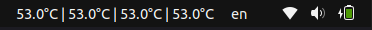

# CPU Core Temp Indicator (GNOME Shell Extension)



CPU Core Temp Indicator is a lightweight GNOME Shell extension that displays per-core CPU temperatures in the top panel. Temperature values are color-coded based on configurable thresholds: green for normal, white for warning, and red for critical.

## Features

- Shows real-time temperature for each CPU core  
- Color-coded based on custom thresholds  
- Updates every 3 seconds  
- Simple configuration in source code

## Requirements

GNOME Shell version 42 is recommended.

To check your GNOME Shell version, run the command `gnome-shell --version` in a terminal. The output will look like this:  
GNOME Shell 42.9

If you're using a different version of GNOME Shell, you can edit the file `metadata.json` in the extension folder.  
Find the line starting with `"shell-version"` and replace it with the versions you want to support. For example:  
"shell-version": ["44", "45"]

You can list multiple versions as a comma-separated list:  
"shell-version": ["42", "43", "44", "45"]

After editing, save the file and restart GNOME Shell to apply the changes.

This extension also requires the `lm-sensors` package.

To check if `lm-sensors` is installed, run the command `which sensors`. If there is no output, install it using your package manager. For example, on Debian/Ubuntu systems, use:  
sudo apt install lm-sensors  
sudo sensors-detect

After installation, test it by running `sensors` to ensure CPU temperature data is displayed (look for entries like "Core 0", "Core 1").

## Installation

1. Clone or download this repository.

2. Setup

   - Check your GNOME Shell version:
     
     ```bash
     gnome-shell --version
     ```

   - Make sure `"shell-version"` in `metadata.json` matches your GNOME Shell version, например:
     
     ```
     "shell-version": ["42"]
     ```

3. Create the extension directory:

   ```bash
   mkdir -p ~/.local/share/gnome-shell/extensions/cputempindicator@custom
   ```

4. Copy the extension files into your local GNOME Shell extensions directory. Usually it is:

    ```bash 
    ~/.local/share/gnome-shell/extensions/cputempindicator@custom
    ```

5. Restart GNOME Shell:  
    Log out of your system to restart GNOME Shell (or restart GNOME Shell if possible)
        - On X11, press Alt + F2, type `r`, and press Enter  
        - On Wayland, log out and log back in

6. Reset the extension (optional)

    ```bash 
    gnome-extensions reset cputempindicator@custom
    ```

7. Enable the extension: 

    ```bash
    gnome-extensions enable cputempindicator@custom
    ```

8. Verify it is enabled by listing active extensions and filtering by name.
    ```bash
    gnome-extensions list --enabled | grep cputemp
    ```

## Configuration

To customize temperature thresholds and colors, open the file `extension.js` in the extension folder and find the `CONFIG` object. Adjust the temperature limits and colors as needed. For example:  
- Normal temperature up to 40°C with green color  
- Warning temperature between 40°C and 70°C with white color  
- Critical temperature above 70°C with red color

## Reset and Uninstall

To reset or disable the extension, use your system's extension manager or run commands to disable and reset the extension.  
To uninstall, simply remove the extension folder from your GNOME Shell extensions directory.

## Files

- `extension.js` — main extension logic  
- `metadata.json` — extension metadata and supported GNOME versions  
- `README.md` — this documentation

## License

This project is licensed under the MIT License. You are free to use, modify, and distribute it.
